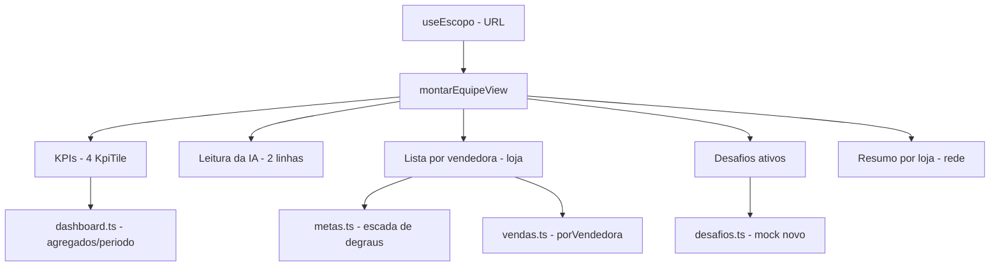

# Aba Equipe — Design

**Spec**: `.specs/features/aba-equipe/spec.md`
**Status**: Draft — aguardando aprovação

---

## Architecture Overview

A aba Equipe segue o **mesmo padrão arquitetural da Visão geral** (AD-030/031/038): casca compartilhada (`DashboardShell`), filtro global via `useEscopo`, camada de visões que calcula tudo (`equipe.ts` em `src/data/gestao/`) e página que só monta blocos com componentes existentes do Vela.

Três decisões estruturais:

1. **`src/data/gestao/equipe.ts` vira a camada de visões da aba.** Hoje o arquivo tem só o cadastro de colaboradores. O cadastro permanece; adiciono as views (`montarEquipeView`, tipos) no mesmo arquivo, seguindo o padrão de `dashboard.ts` (camada de visões da Visão geral). Em períodos maiores que um dia, a página agrupa por vendedora somando `porVendedora` dia a dia — o custo é trivial (17 vendedoras × 31 dias).
2. **Metas individuais são derivadas, não cadastradas.** Nenhuma tabela nova de meta individual: a individual de cada vendedora é `metaDaFilial().valorLoja × (pesoVenda ÷ Σ pesos elegíveis)`, proporcional aos dias elegíveis dela no mês (mesma regra de dias abertos do mock). A soma fecha exato com a meta da loja por construção — sem risco de divergência.
3. **Desafios são um mock novo e pequeno** (`desafios.ts`), com participantes, alvo individual e progresso por vendedora gerado deterministicamente (mesma técnica de ruido do `vendas.ts`). Desafio nunca em reais.



---

## Code Reuse Analysis

### Existing Components to Leverage

| Component | Location | How to Use |
| --- | --- | --- |
| `DashboardShell` | `src/pages/dashboard/DashboardShell.tsx` | Casca (título, filtro, abas) — já configurada para tab "equipe" |
| `useEscopo` | `src/pages/dashboard/useEscopo.ts` | Filtro global na URL |
| `KpiTile` | `src/pages/dashboards/KpiTile.tsx` | Fileira de 4 KPIs (mesmo padrão da Visão geral: 2×2 no celular, 4×1 no desktop) |
| `Card` / `CardTitle` / `CardHeader` | `src/components/ui/Card.tsx` | Moldura dos blocos |
| `ProgressBar` | `src/components/ui/ProgressBar.tsx` | Barra de avanço na escada e progresso dos desafios |
| `Badge` | `src/components/ui/Badge.tsx` | Tendência (subindo/estável/caindo), status de degrau, ponto de atenção |
| `Avatar` | `src/components/ui/Avatar.tsx` | Identidade da vendedora (iniciais + gradiente determinístico por nome) |
| `EmptyState` | `src/components/ui/EmptyState.tsx` | Sem vendedoras / sem meta / sem desafios |
| `Skeleton` | `src/components/ui/Skeleton.tsx` | Loading por bloco (padrão `EstadoBloco` da Visão geral) |
| `blocoEstado`/`EstadoBloco` | `src/pages/dashboard/blocos.tsx` | Reuso direto do padrão de estados por bloco |
| formatadores | `src/lib/formato.ts` | `brl`, `brlK`, `num`, `pct`, `diaSemanaCurto` |

### Integration Points

| System | Integration Method |
| --- | --- |
| `src/data/gestao/vendas.ts` | `porVendedora` por dia (faturamento/atendimentos/itens) — única fonte de vendas individuais |
| `src/data/gestao/metas.ts` | `metaDaFilial()` + `degrausPadrao` — escada e comissão |
| `src/data/gestao/equipe.ts` (cadastro) | Colaboradores elegíveis, admissão, inatividade, turno, `pesoVenda` |
| `src/data/gestao/dashboard.ts` | Reuso de `resolverPeriodo`, regra de competência e formatadores via import |
| `src/data/gestao/desafios.ts` (novo) | Mock de desafios ativos com progresso por participante |

---

## Components

### EquipePage (página)

- **Purpose**: monta a aba Equipe com os blocos da visão.
- **Location**: `src/pages/equipe/EquipePage.tsx`
- **Interfaces**: usa `useEscopo()` e `montarEquipeView(escopo)`; renderiza blocos.
- **Dependencies**: `DashboardShell`, `blocos` (`src/pages/equipe/blocos.tsx`).
- **Reuses**: padrão de composição da `DashboardPage`.

### blocos.tsx (equipe)

- **Purpose**: componentes visuais da aba, um por bloco da visão.
- **Location**: `src/pages/equipe/blocos.tsx`
- **Interfaces**:
  - `BlocoKpisEquipe({ kpis })` — 4 KpiTile (Faturamento, Ticket médio, P.A., Comissão projetada)
  - `BlocoVendedoras({ lista, temMeta })` — `DataTable` de vendedoras; colunas de meta/escada/comissão só entram com meta ativa
  - `BlocoDesafios({ desafios })` — `DataTable` de desafios ativos
  - `BlocoLeituraEquipe({ texto })` — reusa `BlocoLeitura` do dashboard
- **Dependencies**: tipos de `data/gestao/equipe.ts`, componentes UI do Vela.
- **Reuses**: `KpiTile`, `DataTable`, `Card`, `ProgressBar`, `Badge`, `Avatar`, `EmptyState`, `Skeleton`, `EstadoBloco`.

### montarEquipeView (camada de visões)

- **Purpose**: única função que calcula; recebe escopo e devolve a `EquipeView` completa.
- **Location**: `src/data/gestao/equipe.ts`
- **Interfaces**: `montarEquipeView(escopo: Escopo): EquipeView`
- **Dependencies**: `resolverPeriodo`, `diaVendas`, `colaboradoresDaFilial`, `vendedorElegivel`, `metaDaFilial`, `desafiosAtivos`.
- **Reuses**: regra de competência (período mensal usa o mês do período; caso contrário mês corrente, AD-017/023), `EstadoBloco` types.

### desafios.ts (mock novo)

- **Purpose**: desafios ativos da competência corrente com progresso individual determinístico.
- **Location**: `src/data/gestao/desafios.ts`
- **Interfaces**: `interface Desafio`, `desafiosAtivos(competencia: string): Desafio[]`
- **Dependencies**: `relogio` (HOJE_ISO), `colaboradores` (participantes).
- **Reuses**: técnica de geração determinística do `vendas.ts` (ruido com seed).

---

## Data Models (camada de visão)

```typescript
// src/data/gestao/equipe.ts (adições)

export interface KpiEquipeValor {
  valor: string;          // formatado
  delta: { value: string; positive: boolean } | undefined;
}

export interface EscadaLinha {
  nome: string;           // "Meta", "Super Meta"...
  atingimentoMinPct: number;
  comissaoPct: number;
  bonus: number;
  alcançado: boolean;     // realizado >= degrau.atingimentoMinPct% da meta individual
}

export interface VendedoraLinha {
  colaboradorId: string;
  nome: string;
  avatares: undefined;    // Avatar derivado do nome na UI
  faturamento: string;
  faturamentoValor: number;
  atendimentos: number;
  ticket: string;
  pa: string;
  diasTrabalhados: number;
  tendencia: "subindo" | "estavel" | "caindo";
  // Meta individual
  metaIndividualValor: number;
  metaProporcional: boolean;   // admissão/inatividade no meio do mês
  diasElegiveis: number;       // dias abertos elegíveis (para "meta proporcional · N dias")
  atingimentoPct: number;      // realizado ÷ meta individual
  barraPct: number;            // min(100, atingimento)
  // Escada e comissão
  degrauAtual: string | null;  // nome do degrau alcançado
  proximoDegrau: { nome: string; faltaValor: number } | null;
  comissaoAcumulada: number;   // realizado × pct do degrau atual
  bonusAlcancado: number;      // bônus do degrau, se alcançado
  // Atenção
  paAbaixoPct: number | null;  // ≥5% abaixo da média da loja
  // Estados
  semMeta: boolean;            // competência sem meta: lista ordena por faturamento
}

export interface DesafioView {
  id: string;
  nome: string;
  tipo: "produto" | "quantidade" | "indice";
  alvoIndividual: number;      // ex.: 15 un; 3 un de produto; 1.90 de PA
  unidade: string;             // "un", "%", "x"
  premio: number;              // R$ por participante que fecha
  participantes: number;
  engajadas: number;           // participantes com progresso > 0
  progressoAgregado: number;   // soma do progresso individual
  alvoAgregado: number;        // alvo × participantes
  progressoPct: number;        // progressoAgregado ÷ alvoAgregado
  fechaNoRitmo: boolean;       // projeção linear simples até o fim do período
}

/** Com meta ativa: KPI de comissão e colunas de meta/escada entram; sem, só desempenho. */
export interface ComMetaAtiva {
  temMeta: boolean;
}

export interface LojaEquipeResumo {
  filialId: string;
  nome: string;
  tint: TintKey;
  faturamento: string;
  ticket: string;
  pa: string;
  comissaoProjetada: string;
  melhor: { nome: string; atingimentoPct: number } | null;
  pior: { nome: string; atingimentoPct: number } | null;
}

export interface EstadosEquipeView {
  kpis: BlocoEstado;
  leitura: BlocoEstado;
  vendedoras: BlocoEstado;
  desafios: BlocoEstado;
}

export interface EquipeView {
  visao: "loja" | "rede";
  competencia: string;         // "AAAA-MM"
  /** true quando o período do filtro é o mês da competência (meta "ativa"):
   *  colunas de meta/escada/comissão e desafios entram. false: só desempenho. */
  metaAtiva: boolean;
  avisoCompetencia: string | null;  // ex.: "Meta e comissão são do mês — valem para a competência setembro"
  avisos: string[];
  kpiFaturamento: KpiEquipeValor;
  kpiTicket: KpiEquipeValor;
  kpiPA: KpiEquipeValor;
  kpiComissao: KpiEquipeValor | null;  // null sem meta ativa (vira 3 KPIs)
  leitura: string | null;      // texto da IA (via montarLeituraEquipe)
  vendedoras: VendedoraLinha[] | null;   // visão loja
  lojas: LojaEquipeResumo[] | null;      // visão rede
  desafios: DesafioView[] | null;        // null sem meta ativa
  estados: EstadosEquipeView;
}
```

**Relações**: `montarEquipeView` agrega `porVendedora` dos dias do período; metas individuais derivam de `metaDaFilial` × peso (proporcional aos dias elegíveis); comissão usa os degraus da `Meta` da filial; desafios vêm de `desafios.ts`. A visão rede reusa a mesma função por loja e soma.

**Regra de meta ativa (`metaAtiva`)**: o período do filtro é exatamente o mês da competência (Este mês, Mês passado). Em qualquer outro período (Hoje, Ontem, 7 dias, personalizado — inclusive cruzando meses), `metaAtiva = false`: a tela mostra **só desempenho do período** — KPIs (3, sem comissão), tabela de vendedoras sem colunas de meta/escada/comissão e sem desafios. Nada de "escada do mês corrente": a análise de metas é sempre a do mês inteiro, ou não aparece.

---

## Fórmulas centrais (fechadas no context.md)

| Cálculo | Fórmula |
| --- | --- |
| Meta individual | `metaLoja × pesoVenda ÷ Σ pesos elegíveis`, × `diasElegíveis ÷ diasAbertosMês` se parcial |
| Dias elegíveis | dias abertos da loja entre `max(admissão, 1º do mês)` e `min(inatividade, hoje/fim do mês)` |
| Atingimento | `realizado ÷ metaIndividual` |
| Degrau atual | maior degrau com `atingimentoPct ≥ degrau.atingimentoMinPct` |
| Comissão acumulada | `realizado × degrauAtual.comissaoPct ÷ 100` |
| Próximo degrau | `metaIndividual × proximo.atingimentoMinPct ÷ 100 − realizado` |
| Comissão projetada (KPI) | `Σ (comissaoAcumulada + comissão estimada do restante pelo índice de desempenho)` |
| Tendência | `Σ últimos 7 dias vs. 7 anteriores` da vendedora; ±5% = estável |
| P.A. atenção | `paVendedora < 0.95 × média da loja` no período |
| Progresso desafio | soma do progresso individual; alvo agregado = alvo × participantes |
| Fecha no ritmo | `progressoProjetado = progresso ÷ diasDecorridos × diasTotais ≥ alvoAgregado` |

---

## Error Handling Strategy

| Error Scenario | Handling | User Impact |
| --- | --- | --- |
| Competência sem meta | `metaAtiva=false`: só desempenho do período; colunas de meta não existem na tabela | A tela não desliga |
| Período não é o mês da competência (Hoje, 7 dias, cruza meses) | `metaAtiva=false`: só desempenho do período — 3 KPIs, tabela sem colunas de meta/comissão, sem desafios | "Se cruzar o mês, só mostra o desempenho nesse período" (decisão do usuário) |
| Marca selecionada | KPIs/lista refletem o recorte; meta/comissão são da loja inteira com aviso | Padrão da Visão geral |
| Vendedora sem venda no período | Linha com zeros, no fim da ordenação | Sem erro |
| Vendedora inativa no período | Aparece com dias trabalhados até a inatividade; meta proporcional | Venda realizada não some |
| Sem vendedoras elegíveis | EmptyState no bloco | Não quebra o resto |
| Sem desafios ativos | EmptyState na seção, resto da tela intacta | Comportamento esperado |
| Histórico <7 dias para tendência | "estável" | Fallback honesto |
| Carregando | `Skeleton` por bloco (padrão AD-032) | Loading claro |

---

## Risks & Concerns

| Concern | Location | Impact | Mitigation |
| --- | --- | --- | --- |
| `porVendedora` é fração do total do dia (mock), pode gerar distorção com poucos dias | `src/data/gestao/vendas.ts:184` | Atingimento individual distorcido em 1 dia | Aceito: mock determinístico; períodos ≥7 dias suavizam. Sem mudança no gerador nesta rodada |
| `vendedorElegivel` não filtra inatividade por data (só flag) | `src/data/gestao/equipe.ts:57` | Vendedora de férias futura (Fernanda, 10/09) apareceria sem vendas | Filtro de elegibilidade no cálculo: considera admissão ≤ dia ≤ inatividade por dia do período |
| `degrausPadrao` é referenciado como global | `src/data/gestao/metas.ts` | Escada customizada por loja não seria respeitada | Ler degraus da `Meta` da filial (`m.degraus`), não do global |
| Comissão projetada pode dobrar com bônus | `src/data/gestao/equipe.ts` (novo) | KPI inflado | Projeção só do percentual sobre realizado projetado; bônus entra só quando o degrau é alcançado (AC 4.2) |
| Arquivo `equipe.ts` ganha dois papéis (cadastro + visões) | `src/data/gestao/equipe.ts` | Arquivo grande | Manter cadastro no topo, views em seção própria comentada; se crescer muito, extrair `equipeViews.ts` na mesma rodada |
| `EstadoBloco`/tipos exportados de `blocos.tsx` (page layer) | `src/pages/dashboard/blocos.tsx` | data layer importando de page layer violaria a direção das dependências | Mover tipos de estado (`BlocoEstado`) para `data/gestao/equipe.ts` ou reusar de `dashboard.ts`; página importa da camada de dados |

---

## Tech Decisions (only non-obvious ones)

| Decision | Choice | Rationale |
| --- | --- | --- |
| Camada de visões | `equipe.ts` ganha `montarEquipeView`; cadastro permanece no topo | Regra da camada de visões (nenhuma tela calcula); evita arquivo paralelo |
| Meta individual | Derivada (peso × meta da loja), não cadastrada | Soma fecha exato; zero risco de divergência; CRUD fica pra Configurações |
| Desafios | Mock novo `desafios.ts` com progresso determinístico | Mesma técnica do gerador de vendas; tela nunca calcula |
| KPI row | `KpiTile` (padrão Visão geral), não `StatCard` | Consistência com a tela principal que o gestor já conhece |
| Lista de vendedoras | Linhas com `Avatar` + `ProgressBar` + `Badge` (padrão "Sessions by device"/régua) | Componentes existentes; padrão visual já aprovado |
| Estados por bloco | `EstadosEquipeView` espelhando `EstadosLojaView` | Mesmo contrato da Visão geral (AD-032) |

> **Project-level:** nenhum AD novo necessário — o design conforma com AD-004, 017, 023, 030-032, 038. A direção de dependências (data layer não importa page layer) vale como nota da camada, registrada na tabela acima.

---

## Decisões pendentes de aprovação

| Ponto | Proposta |
| --- | --- |
| KPI row | `KpiTile` (mesmo da Visão geral) — confirma? |
| Desafios no data layer | `desafios.ts` mock próprio — confirma? |
| Comissão projetada do KPI | Soma das projeções individuais pelo índice de desempenho — confirma? |