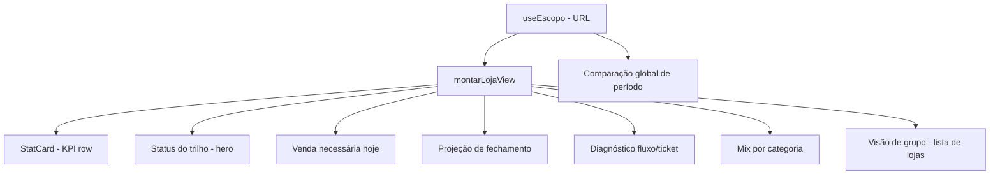

# Aba Loja — Design

**Spec**: `.specs/features/aba-loja/spec.md`
**Status**: Approved — 2026-09-07 (Design aprovado; Tasks criadas e validadas)

---

## Architecture Overview

A nova aba Loja é um **dashboard operacional** (opção 1 aprovada) montado com componentes existentes do template Vela, seguindo o padrão do **Analytics Dashboard** e compondo livremente a partir de outras páginas da demo.

- **Filtro global** (Loja/Período/Marca) continua na URL via `useEscopo` e governa a comparação de período, os KPIs e o mix.
- **Meta/Ritmo/Projeção** seguem a competência derivada do período conforme AD-023: quando o período cabe em um mês, a competência é esse mês; quando cruza meses, é o mês corrente. Eles **não seguem o recorte de dias** selecionado no período.
- A **camada de dados** (`src/data/gestao/loja.ts` + mocks) é estendida com o novo modelo de trilho/diagnóstico, sem que a página calcule nada.
- A `LojaPage` monta blocos usando `StatCard`, `Card`, `CardTitle`, `ProgressBar`, `DonutChart`, `Gauge`, `Badge`, `Avatar`, `EmptyState`, `Skeleton` — nenhum componente paralelo novo.



---

## Code Reuse Analysis

### Existing Components to Leverage

| Component | Location | How to Use |
| --- | --- | --- |
| `PageHeader` | `src/components/ui/PageHeader.tsx` | Título, subtítulo e ações |
| `StatCard` | `src/components/ui/StatCard.tsx` | KPI row (4 cards) |
| `Card` / `CardTitle` / `CardHeader` | `src/components/ui/Card.tsx` | Moldura dos blocos |
| `ProgressBar` | `src/components/ui/ProgressBar.tsx` | Barras de meta/ritmo/mix |
| `DonutChart` | `src/components/charts/DonutChart.tsx` | Mix por categoria / participação |
| `Gauge` | `src/components/charts/Gauge.tsx` | Status do trilho (herói) |
| `Badge` | `src/components/ui/Badge.tsx` | Status e variações |
| `Avatar` | `src/components/ui/Avatar.tsx` | Identidade por loja |
| `EmptyState` | `src/components/ui/EmptyState.tsx` | Sem dados |
| `Skeleton` | `src/components/ui/Skeleton.tsx` | Loading |
| `DataTable` | `src/components/ui/DataTable.tsx` | (se houver tabela de mix/produtos) |
| `AreaLineChart` / `BarChart` | `src/components/charts` | Evolução/receita |
| `AnalyticsDashboardPage` | `src/pages/dashboards/AnalyticsDashboardPage.tsx` | Referência de estrutura (KPI row + cards) |
| `CrmDashboard` | `src/pages/crm/CrmDashboard.tsx` | Referência de atividades/dispositivos/donut |
| `KpiTile` / `KpiMetaTile` | `src/pages/dashboards/KpiTile.tsx` | (opcional) se o layout preferir KpiTile |

### Integration Points

| System | Integration Method |
| --- | --- |
| `src/data/gestao/loja.ts` | Estender `montarLojaView` com novos campos de trilho/diagnóstico |
| `src/data/gestao/vendas.ts` | Expor/reusar `pesoDia` para as curvas |
| `src/data/gestao/filiais.ts` | Lojas, divisões (marca), categorias |
| `src/data/gestao/metas.ts` | Meta mensal por filial |
| `src/components/ui` | Componentes existentes |
| `src/components/charts` | Gráficos existentes |

---

## Components

### LojaPage (página)

- **Purpose**: monta a nova aba Loja redesenha.
- **Location**: `src/pages/loja/LojaPage.tsx`
- **Interfaces**: usa `useEscopo()` e `montarLojaView(escopo)`; renderiza blocos.
- **Dependencies**: `useEscopo`, `dashboard shell` (DashboardShell), `blocos`.
- **Reuses**: padrão do `AnalyticsDashboardPage`.

### DashboardShell (casca)

- **Purpose**: cabeçalho + filtro + abas, igual ao atual.
- **Location**: `src/pages/loja/DashboardShell.tsx`
- **Interfaces**: `{ tab, escopo, onChange, children }`.
- **Reuses**: `PageHeader`, `SeletorEscopo`, `TabNav`.

### Status do trilho (hero)

- **Purpose**: responde "estou no trilho?" em segundos (LOJA-01).
- **Interfaces** (via view): `statusTrilho: "no_trilho" | "atencao" | "abaixo" | "meta_batida" | "meta_nao_batida"`, `pctTrilho`, `competencia`, `simbolo`.
- **Reuses**: `Card`, `Gauge` (ou SVG igual ao Monthly target), `Badge`.

### Venda necessária hoje

- **Purpose**: número operacional único (LOJA-02).
- **Interfaces**: `vendaNecessariaHoje`, `faltaRestante`, `diasAbertosRestantes`, `diaReferencia`.
- **Reuses**: `Card`, `Badge`.

### Projeção de fechamento

- **Purpose**: projeção usando o índice da competência (LOJA-03).
- **Interfaces**: `projecao`, `indiceProjecao`, `projecaoDisponivel`, `pctTrilho` (reutiliza).
- **Reuses**: `Card`, `ProgressBar`.

### Diagnóstico fluxo/ticket + mix

- **Purpose**: gap de fluxo/ticket (LOJA-04) e mix separado.
- **Interfaces**: `efeitoFluxo`, `efeitoTicket`, `alavancaDominante`, `mix`.
- **Reuses**: `Card`, `DonutChart`, `ProgressBar`, `Badge` (padrão CRM "Lead sources"/"Sessions by device").

### Comparação global de período

- **Purpose**: comparação única acima dos KPIs (LOJA-06).
- **Interfaces** via view: `ComparacaoView` (período atual e anterior com agregados de faturamento, atendimentos e itens, além dos rótulos).
- **Regra**: os deltas de cada KPI derivam exclusivamente dessa comparação única; `StatCard` apenas renderiza o delta recebido.
- **Reuses**: `Card` leve / linha (padrão `AnalyticsDashboardPage`).

### Visão de grupo / lista de lojas

- **Purpose**: atende LOJA-05 — abre em todas as lojas, permite tocar numa loja para aprofundar e retornar ao grupo preservando período e marca.
- **Interfaces** via view: `lojas: LojaResumoView[]`.
- **Regra**: cada linha mostra `status`, `pctTrilho`, `temMeta` e `filialId`; tocar numa loja muda apenas `filialId` no escopo (mantém período e marca); o retorno a `"todas"` preserva os filtros.
- **Reuses**: `Card`, `Badge`, `Avatar`, `ProgressBar` (padrão do BlocoRegua atual / "Sessions by device").

### Estados de leitura

- **Purpose**: loading/ausência (LOJA-07).
- **Interfaces** via view: `estados: EstadosLojaView` (um estado por bloco).
- **Reuses**: `Skeleton`, `EmptyState`.

---

## Data Models (camada de visão)

```typescript
// Novos campos em LojaView (data/gestao/loja.ts)
type BlocoEstado = "disponivel" | "carregando" | "sem_dados" | "indisponivel";

interface EstadosLojaView {
  kpis: BlocoEstado;
  trilho: BlocoEstado;
  vendaNecessaria: BlocoEstado;
  projecao: BlocoEstado;
  diagnostico: BlocoEstado;
  mix: BlocoEstado;
  lojas: BlocoEstado;
}

interface TrilhoView {
  status: "no_trilho" | "atencao" | "abaixo" | "meta_batida" | "meta_nao_batida";
  pctTrilho: number | null; // null quando competência encerrada (meta batida/não batida)
  competencia: string;      // "AAAA-MM"
}

interface VendaNecessariaView {
  valor: number | null;          // R$ necessário hoje = (faltaRestante × pesoHoje ÷ Σ pesosRestantes) - realizadoHoje
  realizadoHoje: number;         // realizado do dia (ex.: para a UI mostrar progresso do dia)
  faltaRestante: number;         // R$ que falta no mês
  diasRestantes: number;         // dias abertos restantes
  diaReferencia: string;         // hoje ou próximo dia aberto
  cumpridaHoje: boolean;         // valor necessário de hoje já cumprido
  metaMesAtingida: boolean;      // meta mensal atingida antes do fim da competência
  semMeta: boolean;
}

interface ProjecaoView {
  valor: number | null;          // R$ projetado (null se < dia 7 ou sem meta)
  disponivel: boolean;           // dia >= 7 e tem meta
  encerrada: boolean;
  // percentual NÃO é duplicado aqui: reutiliza TrilhoView.pctTrilho (AD-029)
}

interface LacunaView {
  exibir: boolean;               // decidido na camada de dados: pctTrilho < 90 (AD-033)
  efeitoFluxo: number;           // R$
  efeitoTicket: number;          // R$
  gapTotal: number;              // R$
  alavancaDominante: "fluxo" | "ticket" | null;
  semMeta: boolean;
}

interface MixView {
  itens: { categoria: string; divisao: string; margem: number; receita: number; pct: number }[];
  periodo: string;
}

interface LojaResumoView {
  filialId: string;
  nome: string;
  pctTrilho: number | null;
  status: TrichViewStatus;       // mesmo union de TrilhoView.status
  temMeta: boolean;
}

interface ComparacaoView {
  periodoAtual: {
    inicio: string;
    fim: string;
    faturamento: number;
    atendimentos: number;
    itens: number;
  };
  periodoAnterior: {
    inicio: string;
    fim: string;
    faturamento: number;
    atendimentos: number;
    itens: number;
  };
  rotuloAtual: string;
  rotuloAnterior: string;
}
```

**Relações**: todos derivam de `montarLojaView(escopo)`, que usa `metas`, `vendas` (via `diaVendas`/`agregadoDoDia`), `pesoDia`, `categorias` e a regra de competência AD-023. Os deltas de KPI derivam exclusivamente de `ComparacaoView` (AD-034/AD-032).

---

## Error Handling Strategy

| Error Scenario | Handling | User Impact |
| --- | --- | --- |
| Sem meta na competência | Blocos de meta/projeção/venda/diagnóstico somem; aviso claro | Gestor vê KPIs e comparação, sem painel de decisão de meta |
| Competência encerrada | Mostra "meta batida/não batida" com valor fechado, sem projeção | Consulta meses anteriores sem confusão |
| Período cruza meses | Meta passa ao mês corrente; KPIs/mix usam o período | Painel nunca desliga |
| Sem dados no escopo | `EmptyState` em todo o bloco | Não confunde ausência com zero |
| Bloco parcial sem dados | `EmptyState` só nesse bloco | Demais blocos visíveis |
| Soma da curva zero | Não divide por zero; mostra "sem dados suficientes" | Sem crash |
| Carregamento | `Skeleton` nos blocos | Clareza de loading |

---

## Risks & Concerns

| Concern | Location | Impact | Mitigation |
| --- | --- | --- | --- |
| A camada de dados atual não expõe o modelo de trilho/diagnóstico | `src/data/gestao/loja.ts` | A página não teria os números certos | Estender `montarLojaView` com novos campos e curvas |
| Os blocos atuais (`blocos.tsx`) são específicos do layout antigo | `src/pages/loja/blocos.tsx` | Layout velho pode conflitar com o novo | Reformular a Loja do zero (AD-005); remover blocos órfãos |
| `pesoDia` é uma base de distribuição genérica, não uma curva | `src/data/gestao/vendas.ts` | Usar o mesmo peso para receita e atendimentos colapsaria as duas curvas | Derivar `curvaReceita` dos históricos de faturamento e `curvaAtendimentos` dos históricos de atendimentos; normalizar separadamente; usar `pesoDia` apenas como base/fallback quando faltar histórico (AD-034) |
| Estado de "sem dados/loading" inexistente hoje | `LojaPage.tsx` | Exceções mal tratadas | Adicionar `Skeleton`/`EmptyState` conforme LOJA-07 |
| Dependência de `brlK`/formatadores | `src/lib/formato.ts` | Formatação inconsistente | Reutilizar formatadores existentes |
| Componente `Gauge` | `src/components/charts/Gauge.tsx` | SVG para status | Usar `Gauge` ou SVGs do Monthly target, não criar novo |

---

## Tech Decisions (only non-obvious ones)

| Decision | Choice | Rationale |
| --- | --- | --- |
| KPI row | `StatCard` (padrão Analytics) | Mesmo padrão da referência; suporta delta e sparkline |
| Status do trilho | `Gauge` (semicircular) | Mesmo do "Monthly target" da demo |
| Diagnóstico fluxo/ticket | `Card` com `ProgressBar` + `Badge` (padrão "Sessions by device"/"Lead sources") | Consistente com o restante |
| Mix | `DonutChart` (padrão "Lead sources") | Leitura separada de margem; AC 10 da spec explicitada |
| Camada de dados | Estender `loja.ts`, não criar serviço | Regra da camada de visões |
| Componentes novos | Permitido apenas se não existir equivalente no template | AD-004/AD-031 |

> **Project-level:** a decisão de reutilizar `StatCard`, `Gauge` e o padrão Analytics/CRM vale como convenção para as futuras abas (Financeiro, Equipe, Produtos). Registrada como AD-030/AD-031.

---

## Decisões de composição (aprovadas em 2026-09-07)

| Decisão | Escolha | Rationale |
| --- | --- | --- |
| Fileira de KPIs | **`StatCard`** (padrão Analytics) | Consistente com a referência; suporta variação e sparkline |
| Mix | **`DonutChart`** (padrão Lead sources) | Participação por categoria + legenda de margem; AC 10 da spec explicitada |

## Ajustes do parecer de 2026-09-07 (incorporados)

| Ponto | Ajuste no design |
| --- | --- |
| A1 (LOJA-05) | Novo bloco **Visão de grupo / lista de lojas** + `LojaResumoView` + drill-in preservando período/marca |
| A2 (LOJA-06) | `ComparacaoView` com agregados totalizados; deltas de KPI derivam só dela |
| A3 (LOJA-07) | `EstadosLojaView` com estado por bloco (`disponivel`, `carregando`, `sem_dados`, `indisponivel`) |
| A4 (gate diagnóstico) | `LacunaView.exibir` decidido na camada de dados (`pctTrilho < 90`) |
| B1 (pesoDia) | `curvaReceita` deriva do histórico de faturamento; `curvaAtendimentos` deriva do histórico de atendimentos; normalização separada; `pesoDia` como base/fallback (AD-034) |
| B2 (mix) | Fixado `DonutChart`; AC 10 da spec explicitada |
| B3 (competência) | Frase corrigida: meta/ritmo/projeção seguem a competência derivada do período (AD-023), não o recorte de dias |
| C (`pctTrilho`) | `number \| null` em `TrilhoView` (null em competência encerrada) |
| C (`ProjecaoView.pctTrilho`) | Removido; reutiliza `TrilhoView.pctTrilho` (AD-029) |
| C (`valor` ambíguo) | Comentário com fórmula explícita + campo `realizadoHoje` exposto |
| C (`cumprida`) | Separado em `cumpridaHoje` e `metaMesAtingida` |
| C (`dividao`) | Corrigido para `divisao` |

---

## Tips

- Seguir a estrutura do `AnalyticsDashboardPage` (KPI row → cards 2/3 + 1/3 → demais linhas).
- Não criar `Card` novo nem componente de filtro; compor com `Card`/`CardTitle`/`ProgressBar`.
- A camada de dados é a única que calcula; a página só monta.
- Confirmar antes de partir para Tasks.