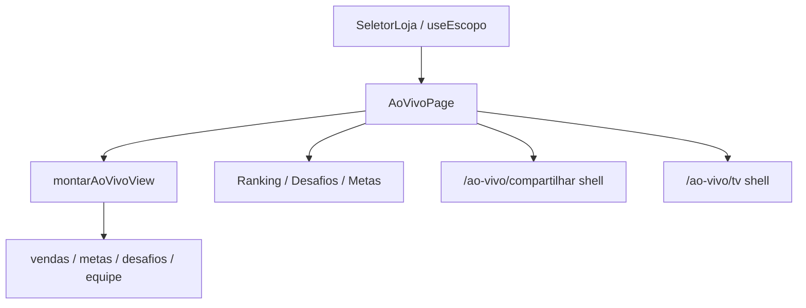

# Ao vivo — Design

**Spec**: `.specs/features/ao-vivo/spec.md`  
**Status**: Approved (product decisions locked in context)

---

## Architecture Overview

Página de leitura no AppShell, alimentada por `montarAoVivoView(escopo)` (fixtures), no mesmo padrão de Equipe/Financeiro. Escopo de loja via `useEscopo` + SeletorLoja no Topbar. Abas locais (Ranking | Desafios | Metas). Rotas shell `/ao-vivo/compartilhar` e `/ao-vivo/tv` para os botões do header.



---

## Code Reuse Analysis

| Component | Location | How to Use |
| --- | --- | --- |
| PageHeader, Button, Card, StatCard, Tabs, Avatar, Badge, ProgressBar, EmptyState | `src/components/ui` | Chrome + KPIs + listas |
| AreaLineChart | `src/components/charts` | Evolução (P2) |
| useEscopo / SeletorLoja | `src/pages/dashboard` | Escopo loja |
| agregadoPeriodo, calcularMeta, kpi helpers | `src/data/gestao/dashboard.ts` | Volumes mês/hoje |
| desafios fixtures + progresso | `src/data/gestao/desafios.ts` + equipeVisoes patterns | Aba Desafios |
| metas fixtures | `src/data/gestao/metas.ts` | Aba Metas |
| nav-gestao / paths / router | layout + router | Menu + rotas |
| Equipe Atualizar pattern | `EquipePage` | Freshness P3 |

---

## Components

### `montarAoVivoView`
- **Location**: `src/data/gestao/aoVivo.ts`
- **Input**: `Escopo`
- **Output**: KPIs (mês + hoje), ranking mês, desafios ativos, meta ativa (vendedor/grupo), evolução opcional, insight mock

### `AoVivoPage`
- **Location**: `src/pages/ao-vivo/AoVivoPage.tsx`
- Header: Compartilhar → `paths.aoVivo.compartilhar`; Modo TV → `paths.aoVivo.tv`; Atualizar
- KPI row 4 StatCards; Tabs Ranking/Desafios/Metas; blocos P2 Evolução + IA

### Shells
- `CompartilharPage.tsx` / `TvPage.tsx` — placeholder Vela (“Em construção — layout externo no próximo corte”) com botão voltar

### Nav / Topbar
- Item Ao vivo no `navGestor` (e gerente se fizer sentido — só gestor no P1)
- `Topbar`: SeletorLoja também em paths `/ao-vivo`

---

## Data Model (view)

```ts
AoVivoView {
  kpis: { vendas, faturamento, metaMensal, atingimento } // primary month, sub today where applicable
  ranking: { posicao, colaboradorId, nome, vendas, faturamento }[]
  desafios: { id, nome, objetivo, restante, premio, acumulado, top3 }[]
  meta: null | { competencia, realizado, alvo, pct, niveis, porVendedor[], porGrupo[] }
  evolucao?: { meses: string[], linhas: { nome, valores: (number|null)[] }[] }
  insightMock: string
}
```

---

## Risks & Concerns

| Risk | Mitigation |
| --- | --- |
| Topbar sem SeletorLoja fora de `/dashboard` | Estender condição `noDashboard` para `/ao-vivo` |
| Duplicar lógica de ranking Equipe | Reusar agregados de vendas + colaboradores; view dedicada fina |
| Shells órfãos | Rotas mínimas + PageHeader Voltar; feature share completa depois |

---

## Tech Decisions

| Decision | Choice | Rationale |
| --- | --- | --- |
| Path base | `/ao-vivo` | Fora do Dashboard (operacional) |
| Share/TV | Shells navegáveis | Botões funcionais agora; UI rica depois |
| Tests | Unit on `montarAoVivoView` | Mesmo padrão `*.test.ts` em `data/gestao` |
