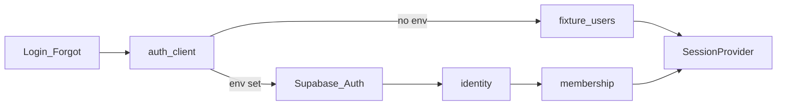

# Auth — Design

## Architecture

## Data (auth core)

- `tenant` — id, slug, name, display_name, …
- `identity` — id, auth_user_id UNIQUE, email UNIQUE, cpf NULLABLE, name, status, temporary_password
- `membership` — identity_id, tenant_id, role, is_owner, onboarding_step, status
- `membership_store` — membership_id, store_id

Roles: `ADMIN_GLOBAL` | `OWNER` | `MANAGER` | `SELLER`  
Status: `PENDING` | `ACTIVE` | `SUSPENDED` | `DECLINED`

## Client

- `@supabase/supabase-js` with `VITE_SUPABASE_URL` + `VITE_SUPABASE_ANON_KEY`
- `src/lib/supabase.ts` — client or null
- `src/session/authApi.ts` — `loginWithEmail`, `logoutAuth`, `requestPasswordReset`, `sessionFromPersistedAuth`

## Front

- Login / Forgot: e-mail field (UI copy PT)
- SessionProvider: persists app `Session`; with Supabase, also Auth session
- Demo: `userByEmail` + any password ≥ 1 char

## Security notes

- Generic errors; recovery always same screen
- Password rules on reset / change-password UI
- RLS: policies by signed-in identity → membership / tenant
