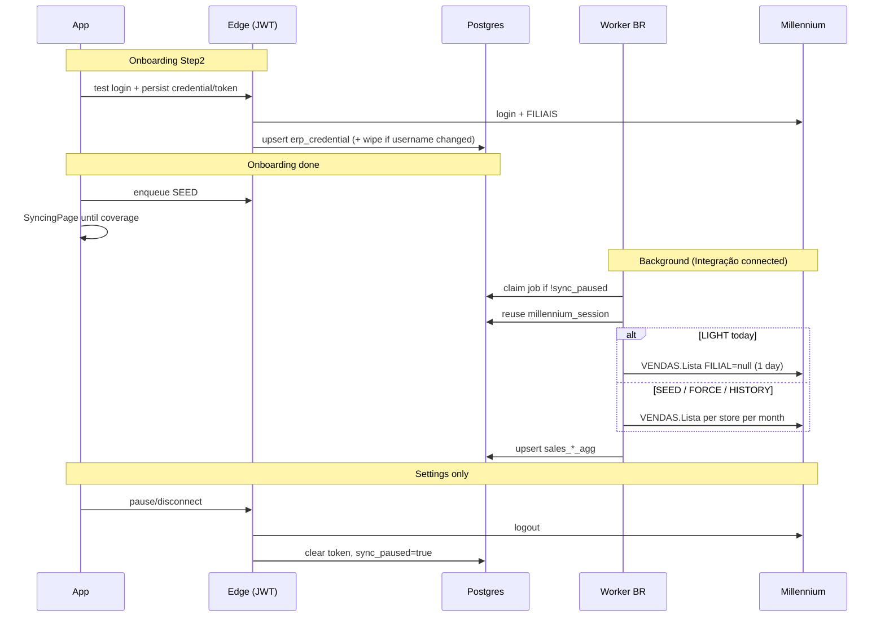

# ERP Integration — Design

**Spec**: `.specs/features/erp-integration/spec.md`  
**Context**: `.specs/features/erp-integration/context.md`  
**Status**: Approved

---

## Architecture Overview

**Approach (chosen):** Keep the existing stack (Postgres + Edge JWT + worker BR + `VENDAS.Lista`), but **replace the sync contract** and **delete competing paths**. Do not rewrite the worker from scratch; do not move sync to Edge (IP BR).

Rejected alternatives:

| Approach | Why not |
| -------- | ------- |
| Rewrite worker greenfield | Same Millennium constraints; loses working Lista/auth/aggs; slower |
| Sync only from Edge (Deno) | Millennium blocks non-BR IPs (AD-015) |
| Keep presence gate + logout-on-signOut | Contradicts AD-021 / HISTORY offline |



**Read path unchanged:** Overview → `salesRepo` → `sales_day_agg` / `sales_hour_agg` only.

---

## Code Reuse Analysis

### Existing Components to Leverage

| Component | Location | How to Use |
| --------- | -------- | ---------- |
| Millennium HTTP client | `workers/millennium-sync/src/millenniumSales.ts`, `millenniumAuth.ts` | Extend Lista with optional null filial; keep map/aggregate |
| Job runner | `workers/millennium-sync/src/runSyncJob.ts` | SEED window, HISTORY follow-up, FORCE gaps; force `STORE_CONCURRENCY=1` for multi-store kinds |
| Claim / enqueue | `workers/millennium-sync/src/deps.ts` | Remove `wedash_present_at` gate; keep `sync_paused` |
| Edge onboarding | `supabase/functions/millennium-onboarding` | persist/wipe/pause/resume; Step2 save |
| Edge credential | `supabase/functions/erp-credential-persist` | Call from Step2 + conclude; add username-change wipe RPC or expand Edge |
| Edge enqueue | `supabase/functions/erp-sync-enqueue` | SEED / FORCE / LIGHT unchanged kinds |
| SyncingPage | `src/pages/onboarding/SyncingPage.tsx` | Fix coverage + busy; keep route |
| salesRepo coverage | `src/data/wedash/salesRepo.ts` | `fetchSyncReady` for SEED window |
| Settings shell | `src/pages/settings/SettingsPage.tsx` + `paths.settings.erp` | Replace ComingSoon ERP with real Integração card |
| Nav | `src/layout/nav-wedash.ts` | Already has “Integração ERP” |

### Integration Points

| System | Method |
| ------ | ------ |
| Millennium | Worker BR only for sync; Edge for login/logout/FILIAIS in wizard |
| Supabase Auth | JWT for Edge; service_role for worker |
| Session WeDash | `signOut` must stop calling ERP pause |

---

## Components

### 1. Credential lifecycle (Edge + app)

- **Purpose**: Persist ERP identity on test; wipe on username change; disconnect only via Integrações.
- **Location**: `millennium-onboarding`, `erp-credential-persist`, `src/data/wedash/erp.ts`, Step2/Onboarding
- **Interfaces**:
  - `testAndPersistCredential(user, pass)` → `{ ok, stores } | { reason }` — login, compare username, wipe if needed, save token
  - `wipeTenantErpData(tenantId)` — stores, membership_store, sales_*_agg, sync_job, sync_run (service_role)
  - `disconnectErp()` → `action: pause` (logout + clear token + `sync_paused`)
  - `resumeErp()` → `action: resume`
- **Dependencies**: `ERP_SECRET_KEY`, Millennium login
- **Reuses**: Existing encrypt + `releaseStored`

### 2. Sync job contract (worker)

- **Purpose**: Four kinds only, predictable Millennium usage.
- **Location**: `runSyncJob.ts`, `deps.ts`, `index.ts`
- **Interfaces**:
  - `SEED` → `seedWindow(today)` = prev month 01 → today; monthly chunks; **sequential stores**
  - `LIGHT` → today; **one** Lista with `FILIAL: null`; split by row `FILIAL` → store map
  - `FORCE` → payload from/to; missing days + today; filial + monthly; sequential
  - `HISTORY` → one month behind earliest; filial + monthly; sequential; enqueue next if above floor
- **Claim rule**: `status=QUEUED` AND credential `VALID` AND `sync_paused=false` AND no sibling `RUNNING`. **No** `wedash_present_at`.
- **Dependencies**: stored session / login renew on 401
- **Reuses**: `chunkByCalendarMonths`, `seedWindow`, `historyFloor`, `enqueueHistoryFollowUp`

### 3. LIGHT all-stores fetch

- **Purpose**: Avoid N Lista calls for “today”.
- **Location**: `millenniumSales.ts` + small helper in `runSyncJob.ts`
- **Interfaces**:
  - `fetchSalesListaAllStores({ session, from, to, eventoIds })` — body with `FILIAL: null`
  - `partitionRowsByFilial(rows, storesByMillenniumId)` → Map<storeId, SaleRow[]>
- **Dependencies**: EVENTO union across stores (or global events)
- **Reuses**: `mapVendasListaPayload` (stamp `storeId` after partition)

### 4. SyncingPage fix

- **Purpose**: Honest progress until SEED coverage exists.
- **Location**: `src/pages/onboarding/SyncingPage.tsx`
- **Interfaces**: poll `fetchLatestSeedJob` + `fetchSyncReady(tenant, { from: seedFrom, to: today })`
- **Behavior**:
  - Stages tied to job status only (no premature ✓ on busy)
  - Busy → retry CTA, bump enqueue once
  - Exit only when coverage true (not when job SUCCEEDED if aggs incomplete)
- **Reuses**: existing helpers; remove reliance on presence bump as unlock

### 5. Integração ERP settings page

- **Purpose**: Show connected user, last sync/error, Desconectar / Retomar.
- **Location**: Replace `ComingSoon` at `paths.settings.erp` with real page (or wire Settings tab); prefer dedicated `/configuracoes/erp` already in nav-wedash.
- **Interfaces**: read `erp_credential` (username, sync_paused, last_*, no password); buttons → `disconnectErp` / `resumeErp`
- **Dependencies**: OWNER (and optionally MANAGER)
- **Reuses**: Vela `Card`, `Button`, `Badge`

### 6. Session cleanup (app)

- **Purpose**: WeDash logout ≠ ERP logout.
- **Location**: `SessionProvider.tsx`, `erp.ts`
- **Changes**: Remove `pauseErpForLogout` from `signOut`; remove heartbeat/`touchErpPresence` loop (or keep as optional watermark only — **default: remove** to avoid confusion).
- **Reuses**: plain `logoutAuth`

### 7. Structured job log

- **Purpose**: One line start / one line end.
- **Location**: `runSyncJob.ts` / `index.ts`
- **Format**: `sync kind=SEED tenant=ac84ee2c job=1bed3402 status=start` / `... status=ok stores=3 ms=120000` / `... status=fail reason=busy`
- **Reuses**: existing console; strip locked spam (already partially done)

### 8. Legacy removal checklist (concurrency)

| Remove / disable | Where |
| ---------------- | ----- |
| Claim gate on `wedash_present_at` | `deps.claimNextJob`, `enqueueDueLightJobs` |
| `pauseErpForLogout` on signOut + presence interval | `SessionProvider` |
| Default parallel store Lista (`STORE_CONCURRENCY=0` → all) for SEED/HISTORY/FORCE | `storeFetchConcurrency` → default **1** |
| Copy “sync only while logged in” / “Sair libera ERP” | CLAUDE.md, SyncingPage, worker banners |
| ComingSoon ERP stub | `coming-soon/routes.tsx` when real page lands |

Optional later: drop column `wedash_present_at` (nullable unused) — not required for MVP if ignored.

---

## Data Models

No new tables required for MVP. Existing:

```typescript
// erp_credential (relevant fields)
interface ErpCredential {
  id: string
  tenantId: string
  username: string
  passwordCiphertext: string
  millenniumSession: string | null
  syncPaused: boolean
  status: "VALID" | "INVALID" | "NOT_CONFIGURED"
  lastLightSyncAt: Date | null
  lastSuccessAt: Date | null
  lastErrorAt: Date | null
  lastError: string | null
  lightIntervalMin: number
  dedicated: boolean
}

// sync_job.kind
type SyncJobKind = "SEED" | "LIGHT" | "FORCE" | "HISTORY" // + legacy aliases mapped if present
```

**Wipe on username change (tenant-scoped):**  
`sales_hour_agg`, `sales_day_agg`, `sync_job`, `sync_run`, `membership_store` rows for ERP stores, `store` rows with `millennium_store_id`, then credential replace.

---

## Error Handling Strategy

| Scenario | Handling | User impact |
| -------- | -------- | ----------- |
| Busy login | Fail job; set `last_error`; SyncingPage / Integrações show occupied | Retry after freeing ERP desktop or wait |
| Bad password | `status=INVALID`; stop LIGHT enqueue | Reconnect in Integrações / onboarding |
| Lista timeout (month) | Fail window/job; keep prior months | FORCE that month later |
| Token 401 | One renew login; update token; retry | Transparent if password still valid |
| Disconnect mid-job | `sync_paused`; best-effort logout; in-flight finishes or fails clean | Integração shows disconnected |
| Duplicate SEED | Edge dedupe QUEUED/RUNNING | No double work |

---

## Risks & Concerns

| Concern | Location | Impact | Mitigation |
| ------- | -------- | ------ | ---------- |
| SyncingPage false progress / stuck | `SyncingPage.tsx` | User trapped or enters empty dash | Coverage-first unlock; busy resets stages (ERPI-07/08/09) |
| Parallel Lista + slow ERP | `runSyncJob.ts` `storeFetchConcurrency` | Timeout / busy | Default concurrency 1 for SEED/HISTORY/FORCE |
| signOut still pauses ERP | `SessionProvider.tsx` | Breaks HISTORY offline (AD-021) | Remove pause from signOut (ERPI-19/24) |
| Presence gate left in claim | `deps.ts` | Jobs idle forever after logout | Delete gate (ERPI-23) |
| Username change without wipe | Step2 persist today | Mixed stores/aggs | Edge wipe before save (ERPI-02) |
| LIGHT without filial ~3 min | Probe 169s | Feels hung | Log start; UI watermark “sincronizando”; acceptable for background |
| Settings ERP still ComingSoon | `coming-soon/routes.tsx` | No disconnect UX | Real page on `paths.settings.erp` (ERPI-20–22) |
| `erp-sync-overview` vs this feature | `.specs/features/erp-sync-overview` | Conflicting docs | This feature owns contract; old feature read-only historical |

---

## Tech Decisions (non-obvious)

| Decision | Choice | Rationale |
| -------- | ------ | --------- |
| Evolve vs rewrite worker | Evolve + strip | Faster; Lista/aggs already proven |
| LIGHT shape | 1 Lista, FILIAL null, today only | Probe-validated; simpler than N calls |
| SEED/HISTORY shape | Filial + calendar month, sequential | Avoids 30d all-stores timeout |
| Disconnect UX | Dedicated `/configuracoes/erp` page | Already in nav-wedash; clearer than template IntegrationsTab |
| Presence column | Ignore (stop writing/reading) | AD-021; avoid migration churn |
| Default STORE_CONCURRENCY | 1 | Headache prevention over wall-clock |

**Project-level (already in STATE):** AD-021, AD-022. No new AD unless disconnect path changes.

---

## Mapping Spec → Design

| IDs | Component |
| --- | --------- |
| ERPI-01…05 | Credential lifecycle |
| ERPI-06…10 | SEED + SyncingPage |
| ERPI-11…14 | LIGHT + FORCE + salesRepo invariant |
| ERPI-15…18 | HISTORY |
| ERPI-19…22 | Session + Integração ERP page |
| ERPI-23…27 | Legacy removal |
| ERPI-28…29 | Job logs + last_error |

---

## Implementation order (for Tasks phase)

1. Legacy strip (presence gate, signOut ERP, concurrency default) — unblock contract  
2. Credential persist on Step2 + username wipe  
3. LIGHT all-stores today  
4. SEED/HISTORY/FORCE sequential monthly (verify windows)  
5. SyncingPage coverage fix  
6. Integração ERP settings page  
7. Logs polish  

Confirm this design to proceed to **Tasks**.
