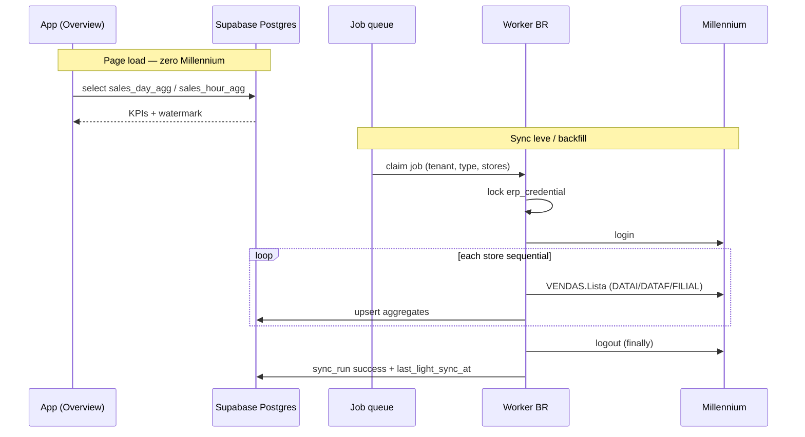

# ERP Sync + Visão Geral — Design

**Spec**: `.specs/features/erp-sync-overview/spec.md`  
**Context**: `.specs/features/erp-sync-overview/context.md`  
**Status**: Approved

---

## Architecture Overview

**Approach (locked by context):** Worker HTTP no Brasil fala com Millennium; Postgres WeDash é a fonte de leitura do dashboard; Supabase Edge só autentica/enfileira (opcional) e serve leituras RLS.



**Read path:** `OverviewPage` → `buildOverviewView` passa a consumir repositório de agregados (Supabase) em vez de `sales.ts` mock.  
**Write path:** só o worker (service role) escreve agregados e `sync_run`.

---

## Code Reuse Analysis

### Existing Components to Leverage

| Component | Location | How to Use |
| --------- | -------- | ---------- |
| Millennium login/logout | `supabase/functions/_shared/millennium.ts` | Extrair/compartilhar cliente HTTP no worker (mesmo `WTS-*`, classify401) |
| Onboarding ERP invoke | `src/data/wedash/erp.ts` | Padrão de Edge invoke; force-refresh chama Edge/RPC que enfileira job |
| Overview UI | `src/pages/dashboards/OverviewPage.tsx` | Manter layout; trocar fonte de `view` + watermark real |
| Scope filters | `src/pages/dashboard/useScope.ts` | Mesmos `filialIds` / período / divisão |
| `buildOverviewView` | `src/data/wedash/dashboard.ts` | Adaptar agregação para ler `SalesDayAgg[]` reais; widgets CMV → empty até pesado |
| Store bridge | `src/data/wedash/stores.ts` (`millenniumFilial`) | Migrar para tabela `store` com `millennium_store_id` |
| VENDAS field rules | `ideia.md` §7.4 | `DATA_H` + fuso; `VALOR_FINAL`; `EVENTO` whitelist `S-X`/`S-03`/`S-100`/`S-{cod}` via `EVENTOS.ListaTodos` |

### Integration Points

| System | Integration Method |
| ------ | ------------------ |
| Millennium | Worker BR: login → `VENDAS.Lista` × filial → logout |
| Supabase Auth / RLS | App lê agregados via policies por `tenant_id` do membership |
| Onboarding | Ao concluir etapas ERP+lojas: upsert `erp_credential` + `store` + enqueue `SEED` → rota `/sincronizando` até watermark |
| Cron | Worker poll a cada 30–60s **ou** cron no BR dispara leve por tenant devido |

---

## Components

### 1. Schema migration — sync + aggregates

- **Purpose**: Tabelas EN para credencial, lojas ERP, runs, agregados diários/horários.
- **Location**: `supabase/migrations/20260922XXXXXX_erp_sync_sales.sql`
- **Interfaces**: SQL + RLS select para `authenticated` no próprio tenant; writes só `service_role`.
- **Dependencies**: `tenant`, `membership`
- **Reuses**: Padrão de migrations auth existentes

### 2. Millennium sales client (worker)

- **Purpose**: Login, `listSales({ storeId, from, to })`, logout com finally.
- **Location**: `workers/millennium-sync/` (ou `services/millennium-sync/`) — **não** só Deno Edge internacional
- **Interfaces**:
  - `login(user, pass): session`
  - `fetchSalesLista(session, params): SaleRow[]`
  - `logout(session): void`
  - `aggregateSales(rows, tz): { days, hours }`
- **Dependencies**: `MILLENNIUM_API_BASE`, secrets de credential decrypt
- **Reuses**: Lógica de `_shared/millennium.ts` (portar/adaptar)

### 3. Sync worker / job runner

- **Purpose**: Claim jobs, lock por credential, backfill 90d e light sync “hoje”, upsert, watermark.
- **Location**: mesmo package do worker BR
- **Interfaces**:
  - `runBackfill(tenantId)`
  - `runLightSync(tenantId)`
  - `claimNextJob(): Job | null`
- **Dependencies**: Postgres (service role), Millennium client
- **Reuses**: Regras busy/password de `classify401`

### 4. Edge (optional orchestrator)

- **Purpose**: `force-refresh` autenticado + enqueue; opcionalmente cron proxy se o worker só polla.
- **Location**: `supabase/functions/erp-sync-enqueue/index.ts` (novo)
- **Interfaces**: `POST { action: "light" | "backfill" }` → row em `sync_job`
- **Dependencies**: JWT user, role OWNER/MANAGER, rate limit 5 min
- **Reuses**: CORS + JWT pattern de `millennium-onboarding`

### 5. App data layer — Overview

- **Purpose**: Carregar agregados + `last_light_sync_at`; montar a mesma `OverviewView` (subset sem CMV real).
- **Location**: `src/data/wedash/salesRepo.ts` (novo) + adaptar `dashboard.ts` / `OverviewPage.tsx`
- **Interfaces**:
  - `fetchSalesDayAggs(scope): Promise<SalesDayAgg[]>`
  - `fetchSalesHourAggs(scope, dayIso): Promise<SalesHourAgg[]>`
  - `fetchSyncWatermark(tenantId): Promise<Date | null>`
  - `requestForceRefresh(): Promise<{ ok, retryAfterSec? }>`
- **Dependencies**: Supabase client, `useScope`
- **Reuses**: Tipos de KPI/`StatCard` existentes

---

## Data Models

### Tables (Postgres)

```sql
-- Credencial ERP (1 por tenant na v1)
erp_credential (
  id uuid PK,
  tenant_id uuid UNIQUE REFERENCES tenant,
  username text NOT NULL,
  password_ciphertext text NOT NULL,  -- AES via vault/secret
  dedicated boolean NOT NULL DEFAULT false,
  status text CHECK (VALID | INVALID | NOT_CONFIGURED),
  last_success_at timestamptz,
  last_error_at timestamptz,
  last_error text,
  light_interval_min int NOT NULL  -- 2 ou 30 derivado de dedicated
)

store (
  id uuid PK,
  tenant_id uuid REFERENCES tenant,
  millennium_store_id int NOT NULL,  -- FILIAL / COD
  code text,                         -- COD_FILIAL display
  name text,
  trade_name text,
  timezone text NOT NULL DEFAULT 'America/Campo_Grande', -- MS default; override per store
  active boolean DEFAULT true,
  UNIQUE (tenant_id, millennium_store_id)
)

-- membership_store.store_id passa a referenciar store.id (uuid) na migração
-- (bridge: mapear erp-N / f1 legado → uuid)

sync_job (
  id uuid PK,
  tenant_id uuid NOT NULL,
  credential_id uuid NOT NULL,
  kind text CHECK (SEED | BACKFILL | LIGHT | FORCE | FORCE_LIGHT | RANGE),
  status text CHECK (QUEUED | RUNNING | SUCCEEDED | FAILED),
  payload jsonb,          -- FORCE/RANGE: { from, to } ISO days
  attempts int DEFAULT 0,
  locked_at timestamptz,
  error text,
  created_at timestamptz,
  finished_at timestamptz
)

sync_run (
  id uuid PK,
  tenant_id uuid,
  credential_id uuid,
  kind text,
  started_at timestamptz,
  finished_at timestamptz,
  ok boolean,
  stores_done int,
  error text
)

-- Agregado diário (chave natural)
sales_day_agg (
  tenant_id uuid,
  store_id uuid REFERENCES store,
  day date,                    -- calendário local da loja
  brand text,                  -- 'WEPINK' | 'WPINK' | 'ALL' se inseparável no payload
  revenue_cents bigint NOT NULL DEFAULT 0,   -- Σ VALOR_FINAL
  sales_count int NOT NULL DEFAULT 0,      -- nº operações (COD_OPERACAO distinto)
  item_count int NOT NULL DEFAULT 0,       -- Σ QUANTIDADE
  PRIMARY KEY (tenant_id, store_id, day, brand)
)

-- Só dia corrente (e limpeza no dia seguinte)
sales_hour_agg (
  tenant_id uuid,
  store_id uuid,
  day date,
  hour smallint CHECK (0..23),
  brand text,
  revenue_cents bigint,
  sales_count int,
  item_count int,
  PRIMARY KEY (tenant_id, store_id, day, hour, brand)
)

-- Denormalizado no tenant ou erp_credential:
-- last_light_sync_at timestamptz
```

### Sale row (in-memory from Millennium)

```typescript
type SaleRow = {
  operationCode: string;      // COD_OPERACAO
  occurredAt: Date;           // DATA_H parsed → store TZ
  revenue: number;            // VALOR_FINAL
  itemQty: number;            // QUANTIDADE
  // brand?: optional if EVENTO / line can infer WEPINK|WPINK — else brand='ALL'
};
```

**Aggregation rules (from ideia.md):**

- Bucket by **store local date/hour of `DATA_H`**, never by ERP `DATA`.
- `sales_count` = distinct `COD_OPERACAO` (not sum of lines if Lista returns lines).
- Ticket médio na UI = `revenue / sales_count` (0 se sales_count=0).
- Backfill window: `today - 90 days` → `yesterday` in daily aggs; light sync refreshes **today** (hours + day partial).

### Overview adaptation

| Widget hoje | v1 com só VENDAS |
| ----------- | ---------------- |
| KPI Faturamento | real |
| KPI CMV | empty / “em breve” (sem mock) |
| KPI Vendas / Ticket | real |
| Evolução faturamento | real (day or hour series) |
| Meta gauges | meta mock/fixture até feature Metas real; realizado = revenue real |
| Top produtos / formas pgto | empty se não houver agregado (fora do mínimo P2) **ou** omitir cards até sync pesado/linha |

**P2 mínimo (spec):** faturamento, nº vendas, ticket, série temporal + empty state. Widgets dependentes de CMV/produto ficam empty — não inventam mock.

---

## Error Handling Strategy

| Error Scenario | Handling | User Impact |
| -------------- | -------- | ----------- |
| Millennium `busy` | Job FAILED/retry com backoff (1/min, max 20) | Watermark antigo; toast opcional no force |
| Senha inválida | `erp_credential.status=INVALID`; stop retries | Banner/owner notification (P3+) |
| Timeout mid-store | finally logout; job retry from incomplete store | Idempotent upsert |
| Empty VENDAS | Upsert zeros ou skip day | Overview mostra 0, não mock |
| Force < 5 min | 429 / `{ retryAfterSec }` | UI desabilita botão |
| Sem agregados ainda | Overview empty/pending | “Sincronizando dados…” |

---

## Risks & Concerns

| Concern | Location | Impact | Mitigation |
| ------- | -------- | ------ | ---------- |
| Millennium IP bloqueia Edge | `supabase/README.md` Brazil IP note | Sync morto se rodar só na Edge | Worker obrigatório no BR (AD-015) |
| Sessão única / orphan lock | `millennium.ts` + ideia §7.3 | Franqueado fora do ERP | Lock por credential + finally logout |
| `DATA` vs `DATA_H` | ideia §7.4 | KPIs no dia errado | Agregar só por `DATA_H` + `store.timezone` |
| `membership_store.store_id` text legado (`f1`) | `auth_core.sql`, `stores.ts` | Join quebrado | Migration: tabela `store` + remap IDs |
| Overview ainda tem CMV/top produtos mock | `OverviewPage.tsx`, `dashboard.ts` | Usuário vê número falso | Empty state explícito; feature flag `USE_REAL_SALES` |
| Credencial em claro no onboarding draft | `draft.ts` sessionStorage | Risco local | Persistir cifrada em `erp_credential` no fim do onboarding; limpar draft |
| Payload VENDAS não amostrado neste Design | — | Map brand/ALL errado | Task 0: curl fixture documentado antes do aggregator |
| Test gap: zero testes de sync | — | Regressão silenciosa | Testes unitários do aggregator + contrato de upsert |

---

## Tech Decisions

| Decision | Choice | Rationale |
| -------- | ------ | --------- |
| Money storage | `bigint` cents | Evita float no Postgres |
| Brand dimension | `ALL` se ERP não separar na Lista | Não inventar split WEPINK/WPINK sem campo |
| Job transport | Tabela `sync_job` + worker poll | Simples no VPS; sem SQS na v1 |
| Encrypt password | App-level AES com key em env do worker (`ERP_SECRET_KEY`) | Sem vault externo no MVP |
| Light window | Calendar “today” in store TZ | Spec: hora só no dia corrente |
| Concurrent jobs | One RUNNING per `credential_id` | Millennium single session |

**Project-level (append to STATE):** AD-015/016 already cover cache + backfill; add AD-017 for `sales_day_agg` as canonical dashboard read model.

---

## Phased delivery (inside this feature)

1. **Schema + credential persist** from onboarding  
2. **Worker SEED + light** + curl fixture for VENDAS  
3. **Overview read path** (KPIs + series + empty CMV)  
4. **Watermark + force refresh** (P3)  
5. **(2026-09-21)** SEED (mês ant.→hoje) + tela `/sincronizando` + FORCE (buracos do período + hoje) + RANGE sob demanda + logs PT  
6. **(2026-09-21)** HISTORY progressivo: após SEED, mês a mês até `max(opened_at, hoje−24m)`; DateRangePicker limitado à cobertura em `sales_day_agg`

---

## Open for Design confirmation

- Default timezone: `America/Campo_Grande` for MS stores OK?  
- Omit vs empty-state for CMV / Top produtos cards in v1?

(Assumptions if no reply: Campo_Grande default; cards CMV/Top produtos show empty state “Disponível após sync completo”, not removed.)
